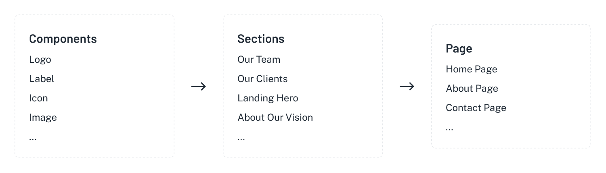

# Structure and Flow

## Structure

```
root
  ├── public
  ├── src
      ├── @types
      ├── api      
      ├── assets
      ├── auth
      ├── components
      ├── constants
      ├── context      
      ├── hooks
      ├── layouts
      ├── pages
      ├── redux
      ├── routes
      ├── sections
      ├── theme
      ├── utils
      ├── ...
  ├── next.config.js
  ├── package.json
...
```

## Flow



## Remove & Clean

Depending on the needs of each project, there will be components that are not needed.

**Below is the order of precedence for deleting components:**

- **Step 1**: Delete unused pages in /pages.
- **Step 2**: Delete the sections corresponding to the deleted page in src/sections.
- **Step 3**: Delete unused components in src/components.
- **Step 4**: Remove unused dependencies.

```
src
  ├── pages
  ├── sections
  ├── components
  ├── ...
...
```
